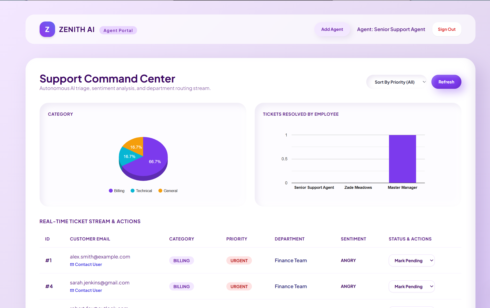

# Zenith AI | Role-Based Support Ticketing & Autonomous Analytics SaaS

Zenith AI is an enterprise-grade, AI-driven support ticketing platform engineered to streamline customer service operations. It features a robust **Spring Boot** backend, **MySQL** persistence layer, autonomous triage, and a futuristic **Claymorphic 3D** frontend UI with real-time analytics.

---

## 📸 Website Preview
> *Below is a preview of the Zenith AI Support Command Center and Manager Analytics Portal:*

*(Note: Ensure your screenshot is placed in `src/main/resources/static/images/` or link your deployed image URL here).*

---

## 🌟 Real-World Problems Solved
Traditional customer support helpdesks often suffer from high operational latency, manual triage bottlenecks, and a lack of clear accountability between managers and support agents. Zenith AI solves these critical business challenges by:
1. **Eliminating Manual Triage Bottlenecks**: Automatically reads incoming customer descriptions, classifies issues (Billing, Technical, Shipping, General), detects sentiment (Angry, Frustrated, Neutral), and assigns priorities instantly.
2. **Granular Staff Account Control**: Prevents unauthorized agent registrations by implementing a mandatory **Manager Approval Workflow** (`accessGranted` boolean flag), ensuring organizational security.
3. **Data-Driven Performance Accountability**: Provides managers with dedicated oversight metrics, tracking exact resolution outputs per employee to optimize team workflows.
4. **Intuitive Visual Load Balancing**: Utilizes 3D extruded charts and column metrics to instantly surface client ticket volumes and department loads at a glance.

---

## 🛠️ Technology Stack
* **Backend Framework**: Java 17, Spring Boot, Spring Data JPA, Hibernate.
* **Database**: MySQL Server (`zenith_ai`).
* **Frontend Design**: HTML5, Tailwind CSS, Custom Claymorphic CSS Styling (Soft 3D shadows and inset lighting).
* **Data Visualization**: Google Charts (3D Pie / Column charts) & Chart.js.
* **AI Engine**: Local Ollama model integration (with automated keyword-fallback processing for zero-downtime reliability).

---

## 📂 Project Directory Structure
```text
zenith-ai/
├── .env                              # Environment configuration (Database credentials)
├── pom.xml                           # Maven dependencies and build configuration
└── src
    ├── main
    │   ├── java
    │   │   └── com/zenith/ai/
    │   │       ├── ZenithAiApplication.java   # Main Spring Boot entry point
    │   │       ├── controller/                # REST Controllers (Auth, Tickets, Users)
    │   │       ├── model/                     # JPA Entities (User, Ticket)
    │   │       └── repository/                # Spring Data JPA Repositories
    │   └── resources
    │       ├── application.properties         # Database and server properties
    │       └── static/                        # Claymorphic Frontend Pages
    │           ├── index.html                 # Landing Page
    │           ├── login.html                 # Authentication & Role Routing
    │           ├── signup.html                # Customer Registration
    │           ├── register-agent.html        # Staff Registration Portal
    │           ├── dashboard.html             # Agent Command Center & Charts
    │           ├── manager-portal.html        # Manager Oversight & Approvals
    │           └── manager-performance.html   # Employee Resolution Metrics & Detail View

    ## 🧗 Development Hurdles & Solutions
During the development of Zenith AI, several engineering challenges were successfully resolved:

* **Hurdle 1: Native HTML Dropdown Styling Limitations**
  * **Problem**: Browser native `<select>` dropdown menus ignored custom CSS background and border styling, breaking the claymorphic aesthetic.
  * **Solution**: Implemented custom CSS wrappers with inset shadow box properties and explicit option padding to seamlessly blend dropdowns into the 3D theme.

* **Hurdle 2: Local AI Model Latency & Timeouts**
  * **Problem**: Relying strictly on local LLMs (like Ollama) occasionally caused server connection failures when the model took too long to respond.
  * **Solution**: Implemented a robust try-catch fallback engine in the ticket controller that instantly triggers keyword-based intelligent categorization if the local model times out.

* **Hurdle 3: Multi-Branch Git Version Control**
  * **Problem**: Ensuring the backend architecture, frontend static assets, and release documentation were properly isolated across `master`, `dev`, and `release` branches without cross-contamination.
  * **Solution**: Strictly staged file paths per branch (`pom.xml` & `src/main/java/` on `master`; `src/main/resources/static/` on `dev`; documentation on `release`).

---

## ⚙️ Directions to Execute the Project

### Prerequisites
* Java Development Kit (JDK 17+)
* Apache Maven
* MySQL Server running locally on port `3306`
* Git

### Step 1: Clone the Repository & Checkout Branches
```bash
git clone [https://github.com/your-username/zenith-ai-support.git](https://github.com/your-username/zenith-ai-support.git)
cd zenith-ai
```

### Step 2: Configure the Database & Environment

Create a MySQL database named `zenith_ai`:

```sql
CREATE DATABASE zenith_ai;
```

Create a `.env` file in the project root directory with the following configuration. Replace `your_mysql_password` with your MySQL password:

```env
SPRING_DATASOURCE_URL=jdbc:mysql://localhost:3306/zenith_ai?useSSL=false&serverTimezone=UTC
SPRING_DATASOURCE_USERNAME=root
SPRING_DATASOURCE_PASSWORD=your_mysql_password
SERVER_PORT=8050
```

### Step 3: Run the Spring Boot Application

Run the application with Maven:

```bash
mvn spring-boot:run
```

You can also import the project into Eclipse or IntelliJ as a Maven project.

### Step 4: Access the Portals

Open your web browser and navigate to [http://localhost:8050/index.html](http://localhost:8050/index.html).

**Master Manager Credentials**

- **Email:** `manager@zenith.ai`
- **Password:** `managerpassword123`

**Customer Portal:** Click **Sign Up** on the landing page to register a new customer account and submit live support tickets.
